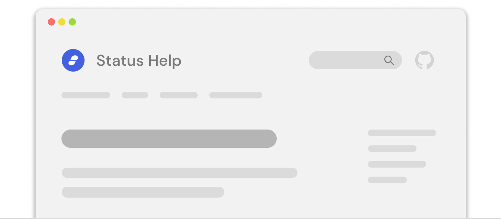

# Status user documentation

This repository contains the documentation website code and Markdown files for [help.status.im](https://help.status.im).

We use [Material for MkDocs](https://squidfunk.github.io/mkdocs-material/) to build the user documentation site.

## Repository branches and git workflow

This repository uses a simplified version of the Gitflow git branching model from [Vicent Driessen](https://nvie.com/posts/a-successful-git-branching-model/):

- The `master` branch stores the official release history, and the `develop` branch serves as an integration branch for new content or fixes.
- The `develop` branch contains the complete history of the documentation project, whereas the `master` branch contains an abridged version.
- Each new content should reside in its own topic branch. Topic branches use `develop` as their parent branch.
- New content and fixes become part of the `develop` branch via [pull request collaboration](https://docs.github.com/en/pull-requests/collaborating-with-pull-requests/proposing-changes-to-your-work-with-pull-requests/creating-a-pull-request-from-a-fork). When a feature is complete, it gets merged back into `develop`.
- Once `develop` has acquired enough content for a release, we merge the develop branch into `master`.

The [Status' Docs team](https://github.com/orgs/status-im/teams/docs) works adding new content and fixes into the `develop` branch, and periodically merging updates with the `master` branch. You can keep track of the different documentation updates in the [releases](https://github.com/status-im/help.status.im/releases) page.

## Contributing

See the [contributing guide](https://github.com/status-im/help.status.im/blob/master/CONTRIBUTING.md) for detailed instructions on how to collaborate with our project.

We accept different types of contributions, including some that don't require you to deal with git or GitHub.

On every article in the Status user documentation, you can click the edit  button to open a pull request for quick fixes like typos, updates, or link fixes.

For more complex contributions, you can [open an issue](https://github.com/status-im/help.status.im/issues/new/choose) using the most appropriate issue template to describe the changes you'd like to see.

If you're looking for a way to contribute, you can scan through [our existing issues](https://github.com/status-im/help.status.im/issues) for something to work on. When ready, check our [contributing guide](https://github.com/status-im/help.status.im/blob/master/CONTRIBUTING.md) for detailed instructions.

## License

The Status user documentation is licensed under the MIT license. The Material for MkDocs components of our documentation are licensed under the [Material for MkDocs license](https://github.com/squidfunk/mkdocs-material/blob/master/LICENSE).
